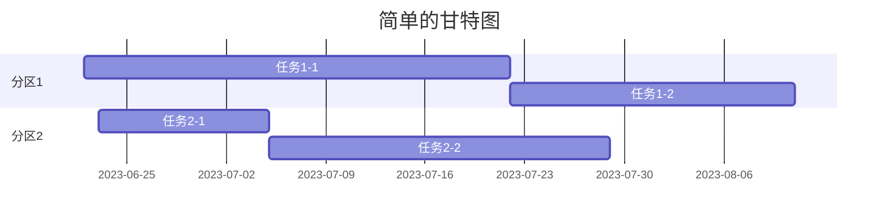
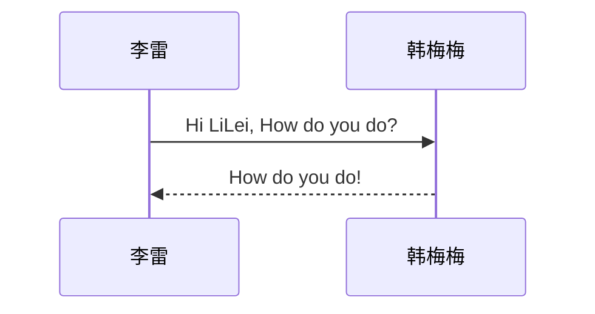

 <font face="微软雅黑" size="10">**markdown 语法总结**</font>
# 一、数学公式 etc
## 1.1 数学公式
Serial|Code|Symbol|Name
:-:|:-:|:-:|:-:
1|`x^2^`/`$X^2$`/`X<sup>2</sup>`|x^2^/$X^2$/X<sup>2</sup>|上标
2|`x~2~`/`$X_2$`/`X<sub>2</sub>`|x~2~/$X_2$/X<sub>2</sub>|下标
3|`$x^2=a$`|$x^2=a$|函数表达式
4|`$x_i^2$`|$x_i^2$|上下标
5|`$log_2^x$`|$log_2^x$|log 函数
6|`$\vec{a}$`|$\vec{a}$|向量
7|`$\overline{a}$`|$\overline{a}$|平均值
8|`$\widehat{a}$`|$\widehat{a}$|线性回归，直线方程
9|`$\widetilde{a}$`|$\widetilde{a}$|颚化符号  等价无穷小
10|`$\dot{a}$`|$\dot{a}$|一阶导数
11|`$\ddot{a}$ `|$\ddot{a}$|二阶导数
12|`$\sum_1^n$`|$\sum_1^n$|连加
13|`$\int_1^\infty$`|$\int_1^\infty$|定积分
14|`$\prod$`|$\prod$|连乘
15|`$\bigcup$`|$\bigcup$|并集
16|`$\bigcap$`|$\bigcap$|交集
17|`$\int$`|$\int$|不定积分
18|`$\iint$`|$\iint$|二重积分
19|`$\iiint$`|$\iiint$|三重积分
20|`$\infty$`|$\infty$|无穷
21|`$\underset {\theta}{min}$`|$\underset {\theta}{min}$|正下方插入下标
22|`$\underset {\theta}{min}$`|$\overset {\theta}{min}$|正上方插入上标
23|`$\pm$`|$\pm$|加减号
24|`$\div$`|          $\div$           |除号
25|`$\cdot$`|$\cdot$|点乘
26|`$\circ$`|$\circ$|句号
27|`$\bigodot$`|$\bigodot$|
28|`$\gep$`|$\geq$|
29|`$\approx$`|$\approx$|
30|`$\coprod$`|$\coprod$|
31|`$\times$`|$\times$|
32|`$\mid$`|$\mid$|
33|`$\ast$`|$\ast$|
34|`$\prod$`|$\prod$|
35|`$\bigotimes$`|$\bigotimes$|
36|`$\leq$`|$\leq$|
37|`$\neq$`|$\neq$|
38|`$\equiv$`|$\equiv$|
39|`$\sum$`|$\sum$|
40|`$\$`|$\$|

> 使用`$加式子$`表示数学公式
> - `$加式子$ `为 LaTex 格式
> `<> </>` 这种格式为 HTML 格式

## 1.2 箭头
|序号|命令|显示|
|:-:|:-:|:-:|
|1|`$\uparrow$`|$\uparrow$|
|2|`$Uparrow$`|$\Uparrow$|
|3|`$\rightarrow$`|$\rightarrow$|
|4|`$\Rightarrow$`|$\Rightarrow$|
|5|`$\downarrow$`|$\downarrow$|
|6|`$\Downarrow$`|$\Downarrow$|
|7|`$\leftarrow$`|$\leftarrow$|
|8|`$\Leftarrow$`|$\Leftarrow$|
## 1.3 集合运算符
|序号|命令|显示|
|:-:|:-:|:-:|
|1|-`$\emptyset$`|$\emptyset$|
|2|`$\in$`|$\in$|
|3|`$\notin$`|$\notin$|
|4|`$\subset$`||
|5|`$\supbet$`||
|6|`$\supbeteq$`||
|7|`$\bigcap$`|$\bigcap$|
|8|`$\bigcup$`|$\bigcup$|
|9|`$\bigvee$`|$\bigvee$|
|11|`$\bigwedge$`|$\bigwedge$|
|12|`$\biguplus$`|$\biguplus$|
|13|`$\bigsqcup$`|$\bigsqcup$|
## 1.4 三角运算符
|序号|命令|显示|
|:-:|:-:|:-:|
|1|`$\bot$`|$\bot$|
|2|`$\angle$`|$\angle$|
|3|`$30^\circ$`|$30^\circ$|
|4|`$\sin$`|$\sin$|
|5|`$\cos$`|$\cos$|
|6|`$\tan$`|$\tan$|
|7|`$\cot$`|$\cot$|
|8|`$\sec$`|$\sec$|
|9|`$\csc$`|$\csc$|
## 1.5 微积分运算符
|序号|命令|显示|
|:-:|:-:|:-:|
|1|`$y\prime$`|$y\prime$|
|2|`$\iint$`|$\iint$|
|3|`$\int$`|$\int$|
|4|`$\lim$`|$\lim$|
|5|$\nable$|$\$|
|6|`$\oint$`|$\oint$|
|7|`$\infty$`|$\infty$|
## 1.6 逻辑运算符
|序号|命令|显示|
|:-:|:-:|:-:|
|1|`$\because$`|$\because$|
|2|`$\therefore$`|$\therefore$|
|3|`$\forall$`|$\forall$|
|4|`$\not=$`|$\not=$|
|5|`$\exists$`|$\exists$|
|6|`$\not>$`|$\not>$|
|7|`$\not\subset$`|$\not\subset$|
# 二、HTML 拓展语法
## 2.1 字体
语法|说明
:-:|:-:
#|标题
**|粗体
*|斜体
***|粗体加斜体
`~~`|删除线
`<font face = "字体"></font>`|字体设置
`<font size = "字体大小"></font>`|字体大小设置
`<font color = "颜色"></font>`|字体颜色设置
`-----`|分割线
`<u></u>`|下划线
`>`|引用
`*` or `+` or `-`|无序列表
`数字` +` .`|有序列表
`flow &`|流程图
`<h></h>`|标题


> - `<hr class="hr1"/>`
> 	- 效果：**一条横线**
> - `<b></b>` or `<strong></strong>`
> 	- 效果：**加粗文字**
> 	- <b>A</b> and <strong>B</strong>
> - `<em></em>` or `<i></i>`
> 	- 效果：**斜体** 
> 	- <em>A</em> and <i>B</i>
> - `<!--这些是注释文本，不会显示-->`
> 	 - 注释

## 2.2 字体拓展
- 斜体：`我是_他_个`
- 我是_他_个

# 三、其他
## 3.1 空格 & 空行
- `&nbsp;`  --  空格
- `&emsp;`  --  空行
## 3.2 删除线
- `~~要删的~~`
- ~~要删的~~
## 3.3 链接
- 网站：`[]()`
- 图片：``
## 3.4 任务列表
- ` - [ ] 待办事项`
- [ ] 待办事项1
- [ ] 待办事项2
- [x] 待办事项3
- [ ] 待办事项4
## 3.5 表格
```markdown
姓名|年龄|性别
----|----|----
小明|11|男
小刚|12|男
小张|13|女
```
姓名|年龄|性别
:-:|----|:-:
小明|11|男
小刚|12|男
小张|13|女
## 3.6 Emoji 表情
- `:grinning:`
- `:heart_eyes:`
- `:speech_balloon:`
- `:peach:`
- **效果**
- :grinning:
- :heart_eyes:
- ::speech_balloon:
- :peach:
- [**Face Smiling Web**](https://www.webfx.com/tools/emoji-cheat-sheet/)

## 3.7 画图
### 3.7.1 甘特图

### 3.7.2 时序图

# 四、CSS + HTML
```html
<div align=left>

</div>
```
<div align=right>

</div>

- 语法解析
	- **Markdown** 图片插入语法解析
	- **HTML** 图片语法解析

# 五、颜色对照表
<div class="table-box"><table><thead><tr><th>颜色名</th><th>十六进制颜色值</th><th align="left">颜色</th><th>样式</th></tr></thead><tbody><tr><td>AliceBlue</td><td>#F0F8FF</td><td align="left">rgb(240, 248, 255)</td><td><font color="#F0F8FF" face="黑体" size="4"> 123456 </font></td></tr><tr><td>AntiqueWhite</td><td>#FAEBD7</td><td align="left">rgb(250, 235, 215)</td><td><font color="#FAEBD7" face="黑体" size="4"> 123456 </font></td></tr><tr><td>Aqua</td><td>#00FFFF</td><td align="left">rgb(0, 255, 255)</td><td><font color="#00FFFF" face="黑体" size="4"> 123456 </font></td></tr><tr><td>Aquamarine</td><td>#7FFFD4</td><td align="left">rgb(127, 255, 212)</td><td><font color="#7FFFD4" face="黑体" size="4"> 123456 </font></td></tr><tr><td>Azure</td><td>#F0FFFF</td><td align="left">rgb(240, 255, 255)</td><td><font color="#F0FFFF" face="黑体" size="4"> 123456 </font></td></tr><tr><td>Beige</td><td>#F5F5DC</td><td align="left">rgb(245, 245, 220)</td><td><font color="#F5F5DC" face="黑体" size="4"> 123456 </font></td></tr><tr><td>Bisque</td><td>#FFE4C4</td><td align="left">rgb(255, 228, 196)</td><td><font color="#FFE4C4" face="黑体" size="4"> 123456 </font></td></tr><tr><td>Black</td><td>#000000</td><td align="left">rgb(0, 0, 0)</td><td><font color="#000000" face="黑体" size="4"> 123456 </font></td></tr><tr><td>BlanchedAlmond</td><td>#FFEBCD</td><td align="left">rgb(255, 235, 205)</td><td><font color="#FFEBCD" face="黑体" size="4"> 123456 </font></td></tr><tr><td>Blue</td><td>#0000FF</td><td align="left">rgb(0, 0, 255)</td><td><font color="#0000FF" face="黑体" size="4"> 123456 </font></td></tr><tr><td>BlueViolet</td><td>#8A2BE2</td><td align="left">rgb(138, 43, 226)</td><td><font color="#8A2BE2" face="黑体" size="4"> 123456 </font></td></tr><tr><td>Brown</td><td>#A52A2A</td><td align="left">rgb(165, 42, 42)</td><td><font color="#A52A2A" face="黑体" size="4"> 123456 </font></td></tr><tr><td>BurlyWood</td><td>#DEB887</td><td align="left">rgb(222, 184, 135)</td><td><font color="#DEB887" face="黑体" size="4"> 123456 </font></td></tr><tr><td>CadetBlue</td><td>#5F9EA0</td><td align="left">rgb(95, 158, 160)</td><td><font color="#5F9EA0" face="黑体" size="4"> 123456 </font></td></tr><tr><td>Chartreuse</td><td>#7FFF00</td><td align="left">rgb(127, 255, 0)</td><td><font color="#7FFF00" face="黑体" size="4"> 123456 </font></td></tr><tr><td>Chocolate</td><td>#D2691E</td><td align="left">rgb(210, 105, 30)</td><td><font color="#D2691E" face="黑体" size="4"> 123456 </font></td></tr><tr><td>Coral</td><td>#FF7F50</td><td align="left">rgb(255, 127, 80)</td><td><font color="#FF7F50" face="黑体" size="4"> 123456 </font></td></tr><tr><td>CornflowerBlue</td><td>#6495ED</td><td align="left">rgb(100, 149, 237)</td><td><font color="#6495ED" face="黑体" size="4"> 123456 </font></td></tr><tr><td>Cornsilk</td><td>#FFF8DC</td><td align="left">rgb(255, 248, 220)</td><td><font color="#FFF8DC" face="黑体" size="4"> 123456 </font></td></tr><tr><td>Crimson</td><td>#DC143C</td><td align="left">rgb(220, 20, 60)</td><td><font color="#DC143C" face="黑体" size="4"> 123456 </font></td></tr><tr><td>Cyan</td><td>#00FFFF</td><td align="left">rgb(0, 255, 255)</td><td><font color="#00FFFF" face="黑体" size="4"> 123456 </font></td></tr><tr><td>DarkBlue</td><td>#00008B</td><td align="left">rgb(0, 0, 139)</td><td><font color="#00008B" face="黑体" size="4"> 123456 </font></td></tr><tr><td>DarkCyan</td><td>#008B8B</td><td align="left">rgb(0, 139, 139)</td><td><font color="#008B8B" face="黑体" size="4"> 123456 </font></td></tr><tr><td>DarkGoldenRod</td><td>#B8860B</td><td align="left">rgb(184, 134, 11)</td><td><font color="#B8860B" face="黑体" size="4"> 123456 </font></td></tr><tr><td>DarkGray</td><td>#A9A9A9</td><td align="left">rgb(169, 169, 169)</td><td><font color="#A9A9A9" face="黑体" size="4"> 123456 </font></td></tr><tr><td>DarkGreen</td><td>#006400</td><td align="left">rgb(0, 100, 0)</td><td><font color="#006400" face="黑体" size="4"> 123456 </font></td></tr><tr><td>DarkKhaki</td><td>#BDB76B</td><td align="left">rgb(189, 183, 107)</td><td><font color="#BDB76B" face="黑体" size="4"> 123456 </font></td></tr><tr><td>DarkMagenta</td><td>#8B008B</td><td align="left">rgb(139, 0, 139)</td><td><font color="#8B008B" face="黑体" size="4"> 123456 </font></td></tr><tr><td>DarkOliveGreen</td><td>#556B2F</td><td align="left">rgb(85, 107, 47)</td><td><font color="#556B2F" face="黑体" size="4"> 123456 </font></td></tr><tr><td>Darkorange</td><td>#FF8C00</td><td align="left">rgb(255, 140, 0)</td><td><font color="#FF8C00" face="黑体" size="4"> 123456 </font></td></tr><tr><td>DarkOrchid</td><td>#9932CC</td><td align="left">rgb(153, 50, 204)</td><td><font color="#9932CC" face="黑体" size="4"> 123456 </font></td></tr><tr><td>DarkRed</td><td>#8B0000</td><td align="left">rgb(139, 0, 0)</td><td><font color="#8B0000" face="黑体" size="4"> 123456 </font></td></tr><tr><td>DarkSalmon</td><td>#E9967A</td><td align="left">rgb(233, 150, 122)</td><td><font color="#E9967A" face="黑体" size="4"> 123456 </font></td></tr><tr><td>DarkSeaGreen</td><td>#8FBC8F</td><td align="left">rgb(143, 188, 143)</td><td><font color="#8FBC8F" face="黑体" size="4"> 123456 </font></td></tr><tr><td>DarkSlateBlue</td><td>#483D8B</td><td align="left">rgb(72, 61, 139)</td><td><font color="#483D8B" face="黑体" size="4"> 123456 </font></td></tr><tr><td>DarkSlateGray</td><td>#2F4F4F</td><td align="left">rgb(47, 79, 79)</td><td><font color="#2F4F4F" face="黑体" size="4"> 123456 </font></td></tr><tr><td>DarkTurquoise</td><td>#00CED1</td><td align="left">rgb(0, 206, 209)</td><td><font color="#00CED1" face="黑体" size="4"> 123456 </font></td></tr><tr><td>DarkViolet</td><td>#9400D3</td><td align="left">rgb(148, 0, 211)</td><td><font color="#9400D3" face="黑体" size="4"> 123456 </font></td></tr><tr><td>DeepPink</td><td>#FF1493</td><td align="left">rgb(255, 20, 147)</td><td><font color="#FF1493" face="黑体" size="4"> 123456 </font></td></tr><tr><td>DeepSkyBlue</td><td>#00BFFF</td><td align="left">rgb(0, 191, 255)</td><td><font color="#00BFFF" face="黑体" size="4"> 123456 </font></td></tr><tr><td>DimGray</td><td>#696969</td><td align="left">rgb(105, 105, 105)</td><td><font color="#696969" face="黑体" size="4"> 123456 </font></td></tr><tr><td>DodgerBlue</td><td>#1E90FF</td><td align="left">rgb(30, 144, 255)</td><td><font color="#1E90FF" face="黑体" size="4"> 123456 </font></td></tr><tr><td>Feldspar</td><td>#D19275</td><td align="left">rgb(209, 146, 117)</td><td><font color="#D19275" face="黑体" size="4"> 123456 </font></td></tr><tr><td>FireBrick</td><td>#B22222</td><td align="left">rgb(178, 34, 34)</td><td><font color="#B22222" face="黑体" size="4"> 123456 </font></td></tr><tr><td>FloralWhite</td><td>#FFFAF0</td><td align="left">rgb(255, 250, 240)</td><td><font color="#FFFAF0" face="黑体" size="4"> 123456 </font></td></tr><tr><td>ForestGreen</td><td>#228B22</td><td align="left">rgb(34, 139, 34)</td><td><font color="#228B22" face="黑体" size="4"> 123456 </font></td></tr><tr><td>Fuchsia</td><td>#FF00FF</td><td align="left">rgb(255, 0, 255)</td><td><font color="#FF00FF" face="黑体" size="4"> 123456 </font></td></tr><tr><td>Gainsboro</td><td>#DCDCDC</td><td align="left">rgb(220, 220, 220)</td><td><font color="#DCDCDC" face="黑体" size="4"> 123456 </font></td></tr><tr><td>GhostWhite</td><td>#F8F8FF</td><td align="left">rgb(248, 248, 255)</td><td><font color="#F8F8FF" face="黑体" size="4"> 123456 </font></td></tr><tr><td>Gold</td><td>#FFD700</td><td align="left">rgb(255, 215, 0)</td><td><font color="#FFD700" face="黑体" size="4"> 123456 </font></td></tr><tr><td>GoldenRod</td><td>#DAA520</td><td align="left">rgb(218, 165, 32)</td><td><font color="#DAA520" face="黑体" size="4"> 123456 </font></td></tr><tr><td>Gray</td><td>#808080</td><td align="left">rgb(128, 128, 128)</td><td><font color="#808080" face="黑体" size="4"> 123456 </font></td></tr><tr><td>Green</td><td>#008000</td><td align="left">rgb(0, 128, 0)</td><td><font color="#008000" face="黑体" size="4"> 123456 </font></td></tr><tr><td>GreenYellow</td><td>#ADFF2F</td><td align="left">rgb(173, 255, 47)</td><td><font color="#ADFF2F" face="黑体" size="4"> 123456 </font></td></tr><tr><td>HoneyDew</td><td>#F0FFF0</td><td align="left">rgb(240, 255, 240)</td><td><font color="#F0FFF0" face="黑体" size="4"> 123456 </font></td></tr><tr><td>HotPink</td><td>#FF69B4</td><td align="left">rgb(255, 105, 180)</td><td><font color="#FF69B4" face="黑体" size="4"> 123456 </font></td></tr><tr><td>IndianRed</td><td>#CD5C5C</td><td align="left">rgb(205, 92, 92)</td><td><font color="#CD5C5C" face="黑体" size="4"> 123456 </font></td></tr><tr><td>Indigo</td><td>#4B0082</td><td align="left">rgb(75, 0, 130)</td><td><font color="#4B0082" face="黑体" size="4"> 123456 </font></td></tr><tr><td>Ivory</td><td>#FFFFF0</td><td align="left">rgb(255, 255, 240)</td><td><font color="#FFFFF0" face="黑体" size="4"> 123456 </font></td></tr><tr><td>Khaki</td><td>#F0E68C</td><td align="left">rgb(240, 230, 140)</td><td><font color="#F0E68C" face="黑体" size="4"> 123456 </font></td></tr><tr><td>Lavender</td><td>#E6E6FA</td><td align="left">rgb(230, 230, 250)</td><td><font color="#E6E6FA" face="黑体" size="4"> 123456 </font></td></tr><tr><td>LavenderBlush</td><td>#FFF0F5</td><td align="left">rgb(255, 240, 245)</td><td><font color="#FFF0F5" face="黑体" size="4"> 123456 </font></td></tr><tr><td>LawnGreen</td><td>#7CFC00</td><td align="left">rgb(124, 252, 0)</td><td><font color="#7CFC00" face="黑体" size="4"> 123456 </font></td></tr><tr><td>LemonChiffon</td><td>#FFFACD</td><td align="left">rgb(255, 250, 205)</td><td><font color="#FFFACD" face="黑体" size="4"> 123456 </font></td></tr><tr><td>LightBlue</td><td>#ADD8E6</td><td align="left">rgb(173, 216, 230)</td><td><font color="#ADD8E6" face="黑体" size="4"> 123456 </font></td></tr><tr><td>LightCoral</td><td>#F08080</td><td align="left">rgb(240, 128, 128)</td><td><font color="#F08080" face="黑体" size="4"> 123456 </font></td></tr><tr><td>LightCyan</td><td>#E0FFFF</td><td align="left">rgb(224, 255, 255)</td><td><font color="#E0FFFF" face="黑体" size="4"> 123456 </font></td></tr><tr><td>LightGoldenRodYellow</td><td>#FAFAD2</td><td align="left">rgb(250, 250, 210)</td><td><font color="#FAFAD2" face="黑体" size="4"> 123456 </font></td></tr><tr><td>LightGrey</td><td>#D3D3D3</td><td align="left">rgb(211, 211, 211)</td><td><font color="#D3D3D3" face="黑体" size="4"> 123456 </font></td></tr><tr><td>LightGreen</td><td>#90EE90</td><td align="left">rgb(144, 238, 144)</td><td><font color="#90EE90" face="黑体" size="4"> 123456 </font></td></tr><tr><td>LightPink</td><td>#FFB6C1</td><td align="left">rgb(255, 182, 193)</td><td><font color="#FFB6C1" face="黑体" size="4"> 123456 </font></td></tr><tr><td>LightSalmon</td><td>#FFA07A</td><td align="left">rgb(255, 160, 122)</td><td><font color="#FFA07A" face="黑体" size="4"> 123456 </font></td></tr><tr><td>LightSeaGreen</td><td>#20B2AA</td><td align="left">rgb(32, 178, 170)</td><td><font color="#20B2AA" face="黑体" size="4"> 123456 </font></td></tr><tr><td>LightSkyBlue</td><td>#87CEFA</td><td align="left">rgb(135, 206, 250)</td><td><font color="#87CEFA" face="黑体" size="4"> 123456 </font></td></tr><tr><td>LightSlateBlue</td><td>#8470FF</td><td align="left">rgb(132, 112, 255)</td><td><font color="#8470FF" face="黑体" size="4"> 123456 </font></td></tr><tr><td>LightSlateGray</td><td>#778899</td><td align="left">rgb(119, 136, 153)</td><td><font color="#778899" face="黑体" size="4"> 123456 </font></td></tr><tr><td>LightSteelBlue</td><td>#B0C4DE</td><td align="left">rgb(176, 196, 222)</td><td><font color="#B0C4DE" face="黑体" size="4"> 123456 </font></td></tr><tr><td>LightYellow</td><td>#FFFFE0</td><td align="left">rgb(255, 255, 224)</td><td><font color="#FFFFE0" face="黑体" size="4"> 123456 </font></td></tr><tr><td>Lime</td><td>#00FF00</td><td align="left">rgb(0, 255, 0)</td><td><font color="#00FF00" face="黑体" size="4"> 123456 </font></td></tr><tr><td>LimeGreen</td><td>#32CD32</td><td align="left">rgb(50, 205, 50)</td><td><font color="#32CD32" face="黑体" size="4"> 123456 </font></td></tr><tr><td>Linen</td><td>#FAF0E6</td><td align="left">rgb(250, 240, 230)</td><td><font color="#FAF0E6" face="黑体" size="4"> 123456 </font></td></tr><tr><td>Magenta</td><td>#FF00FF</td><td align="left">rgb(255, 0, 255)</td><td><font color="#FF00FF" face="黑体" size="4"> 123456 </font></td></tr><tr><td>Maroon</td><td>#800000</td><td align="left">rgb(128, 0, 0)</td><td><font color="#800000" face="黑体" size="4"> 123456 </font></td></tr><tr><td>MediumAquaMarine</td><td>#66CDAA</td><td align="left">rgb(102, 205, 170)</td><td><font color="#66CDAA" face="黑体" size="4"> 123456 </font></td></tr><tr><td>MediumBlue</td><td>#0000CD</td><td align="left">rgb(0, 0, 205)</td><td><font color="#0000CD" face="黑体" size="4"> 123456 </font></td></tr><tr><td>MediumOrchid</td><td>#BA55D3</td><td align="left">rgb(186, 85, 211)</td><td><font color="#BA55D3" face="黑体" size="4"> 123456 </font></td></tr><tr><td>MediumPurple</td><td>#9370D8</td><td align="left">rgb(147, 112, 216)</td><td><font color="#9370D8" face="黑体" size="4"> 123456 </font></td></tr><tr><td>MediumSeaGreen</td><td>#3CB371</td><td align="left">rgb(60, 179, 113)</td><td><font color="#3CB371" face="黑体" size="4"> 123456 </font></td></tr><tr><td>MediumSlateBlue</td><td>#7B68EE</td><td align="left">rgb(123, 104, 238)</td><td><font color="#7B68EE" face="黑体" size="4"> 123456 </font></td></tr><tr><td>MediumSpringGreen</td><td>#00FA9A</td><td align="left">rgb(0, 250, 154)</td><td><font color="#00FA9A" face="黑体" size="4"> 123456 </font></td></tr><tr><td>MediumTurquoise</td><td>#48D1CC</td><td align="left">rgb(72, 209, 204)</td><td><font color="#48D1CC" face="黑体" size="4"> 123456 </font></td></tr><tr><td>MediumVioletRed</td><td>#C71585</td><td align="left">rgb(199, 21, 133)</td><td><font color="#C71585" face="黑体" size="4"> 123456 </font></td></tr><tr><td>MidnightBlue</td><td>#191970</td><td align="left">rgb(25, 25, 112)</td><td><font color="#191970" face="黑体" size="4"> 123456 </font></td></tr><tr><td>MintCream</td><td>#F5FFFA</td><td align="left">rgb(245, 255, 250)</td><td><font color="#F5FFFA" face="黑体" size="4"> 123456 </font></td></tr><tr><td>MistyRose</td><td>#FFE4E1</td><td align="left">rgb(255, 228, 225)</td><td><font color="#FFE4E1" face="黑体" size="4"> 123456 </font></td></tr><tr><td>Moccasin</td><td>#FFE4B5</td><td align="left">rgb(255, 228, 181)</td><td><font color="#FFE4B5" face="黑体" size="4"> 123456 </font></td></tr><tr><td>NavajoWhite</td><td>#FFDEAD</td><td align="left">rgb(255, 222, 173)</td><td><font color="#FFDEAD" face="黑体" size="4"> 123456 </font></td></tr><tr><td>Navy</td><td>#000080</td><td align="left">rgb(0, 0, 128)</td><td><font color="#000080" face="黑体" size="4"> 123456 </font></td></tr><tr><td>OldLace</td><td>#FDF5E6</td><td align="left">rgb(253, 245, 230)</td><td><font color="#FDF5E6" face="黑体" size="4"> 123456 </font></td></tr><tr><td>Olive</td><td>#808000</td><td align="left">rgb(128, 128, 0)</td><td><font color="#808000" face="黑体" size="4"> 123456 </font></td></tr><tr><td>OliveDrab</td><td>#6B8E23</td><td align="left">rgb(107, 142, 35)</td><td><font color="#6B8E23" face="黑体" size="4"> 123456 </font></td></tr><tr><td>Orange</td><td>#FFA500</td><td align="left">rgb(255, 165, 0)</td><td><font color="#FFA500" face="黑体" size="4"> 123456 </font></td></tr><tr><td>OrangeRed</td><td>#FF4500</td><td align="left">rgb(255, 69, 0)</td><td><font color="#FF4500" face="黑体" size="4"> 123456 </font></td></tr><tr><td>Orchid</td><td>#DA70D6</td><td align="left">rgb(218, 112, 214)</td><td><font color="#DA70D6" face="黑体" size="4"> 123456 </font></td></tr><tr><td>PaleGoldenRod</td><td>#EEE8AA</td><td align="left">rgb(238, 232, 170)</td><td><font color="#EEE8AA" face="黑体" size="4"> 123456 </font></td></tr><tr><td>PaleGreen</td><td>#98FB98</td><td align="left">rgb(152, 251, 152)</td><td><font color="#98FB98" face="黑体" size="4"> 123456 </font></td></tr><tr><td>PaleTurquoise</td><td>#AFEEEE</td><td align="left">rgb(175, 238, 238)</td><td><font color="#AFEEEE" face="黑体" size="4"> 123456 </font></td></tr><tr><td>PaleVioletRed</td><td>#D87093</td><td align="left">rgb(216, 112, 147)</td><td><font color="#D87093" face="黑体" size="4"> 123456 </font></td></tr><tr><td>PapayaWhip</td><td>#FFEFD5</td><td align="left">rgb(255, 239, 213)</td><td><font color="#FFEFD5" face="黑体" size="4"> 123456 </font></td></tr><tr><td>PeachPuff</td><td>#FFDAB9</td><td align="left">rgb(255, 218, 185)</td><td><font color="#FFDAB9" face="黑体" size="4"> 123456 </font></td></tr><tr><td>Peru</td><td>#CD853F</td><td align="left">rgb(205, 133, 63)</td><td><font color="#CD853F" face="黑体" size="4"> 123456 </font></td></tr><tr><td>Pink</td><td>#FFC0CB</td><td align="left">rgb(255, 192, 203)</td><td><font color="#FFC0CB" face="黑体" size="4"> 123456 </font></td></tr><tr><td>Plum</td><td>#DDA0DD</td><td align="left">rgb(221, 160, 221)</td><td><font color="#DDA0DD" face="黑体" size="4"> 123456 </font></td></tr><tr><td>PowderBlue</td><td>#B0E0E6</td><td align="left">rgb(176, 224, 230)</td><td><font color="#B0E0E6" face="黑体" size="4"> 123456 </font></td></tr><tr><td>Purple</td><td>#800080</td><td align="left">rgb(128, 0, 128)</td><td><font color="#800080" face="黑体" size="4"> 123456 </font></td></tr><tr><td>Red</td><td>#FF0000</td><td align="left">rgb(255, 0, 0)</td><td><font color="#FF0000" face="黑体" size="4"> 123456 </font></td></tr><tr><td>RosyBrown</td><td>#BC8F8F</td><td align="left">rgb(188, 143, 143)</td><td><font color="#BC8F8F" face="黑体" size="4"> 123456 </font></td></tr><tr><td>RoyalBlue</td><td>#4169E1</td><td align="left">rgb(65, 105, 225)</td><td><font color="#4169E1" face="黑体" size="4"> 123456 </font></td></tr><tr><td>SaddleBrown</td><td>#8B4513</td><td align="left">rgb(139, 69, 19)</td><td><font color="#8B4513" face="黑体" size="4"> 123456 </font></td></tr><tr><td>Salmon</td><td>#FA8072</td><td align="left">rgb(250, 128, 114)</td><td><font color="#FA8072" face="黑体" size="4"> 123456 </font></td></tr><tr><td>SandyBrown</td><td>#F4A460</td><td align="left">rgb(244, 164, 96)</td><td><font color="#F4A460" face="黑体" size="4"> 123456 </font></td></tr><tr><td>SeaGreen</td><td>#2E8B57</td><td align="left">rgb(46, 139, 87)</td><td><font color="#2E8B57" face="黑体" size="4"> 123456 </font></td></tr><tr><td>SeaShell</td><td>#FFF5EE</td><td align="left">rgb(255, 245, 238)</td><td><font color="#FFF5EE" face="黑体" size="4"> 123456 </font></td></tr><tr><td>Sienna</td><td>#A0522D</td><td align="left">rgb(160, 82, 45)</td><td><font color="#A0522D" face="黑体" size="4"> 123456 </font></td></tr><tr><td>Silver</td><td>#C0C0C0</td><td align="left">rgb(192, 192, 192)</td><td><font color="#C0C0C0" face="黑体" size="4"> 123456 </font></td></tr><tr><td>SkyBlue</td><td>#87CEEB</td><td align="left">rgb(135, 206, 235)</td><td><font color="#87CEEB" face="黑体" size="4"> 123456 </font></td></tr><tr><td>SlateBlue</td><td>#6A5ACD</td><td align="left">rgb(106, 90, 205)</td><td><font color="#6A5ACD" face="黑体" size="4"> 123456 </font></td></tr><tr><td>SlateGray</td><td>#708090</td><td align="left">rgb(112, 128, 144)</td><td><font color="#708090" face="黑体" size="4"> 123456 </font></td></tr><tr><td>Snow</td><td>#FFFAFA</td><td align="left">rgb(255, 250, 250)</td><td><font color="#FFFAFA" face="黑体" size="4"> 123456 </font></td></tr><tr><td>SpringGreen</td><td>#00FF7F</td><td align="left">rgb(0, 255, 127)</td><td><font color="#00FF7F" face="黑体" size="4"> 123456 </font></td></tr><tr><td>SteelBlue</td><td>#4682B4</td><td align="left">rgb(70, 130, 180)</td><td><font color="#4682B4" face="黑体" size="4"> 123456 </font></td></tr><tr><td>Tan</td><td>#D2B48C</td><td align="left">rgb(210, 180, 140)</td><td><font color="#D2B48C" face="黑体" size="4"> 123456 </font></td></tr><tr><td>Teal</td><td>#008080</td><td align="left">rgb(0, 128, 128)</td><td><font color="#008080" face="黑体" size="4"> 123456 </font></td></tr><tr><td>Thistle</td><td>#D8BFD8</td><td align="left">rgb(216, 191, 216)</td><td><font color="#D8BFD8" face="黑体" size="4"> 123456 </font></td></tr><tr><td>Tomato</td><td>#FF6347</td><td align="left">rgb(255, 99, 71)</td><td><font color="#FF6347" face="黑体" size="4"> 123456 </font></td></tr><tr><td>Turquoise</td><td>#40E0D0</td><td align="left">rgb(64, 224, 208)</td><td><font color="#40E0D0" face="黑体" size="4"> 123456 </font></td></tr><tr><td>Violet</td><td>#EE82EE</td><td align="left">rgb(238, 130, 238)</td><td><font color="#EE82EE" face="黑体" size="4"> 123456 </font></td></tr><tr><td>VioletRed</td><td>#D02090</td><td align="left">rgb(208, 32, 144)</td><td><font color="#D02090" face="黑体" size="4"> 123456 </font></td></tr><tr><td>Wheat</td><td>#F5DEB3</td><td align="left">rgb(245, 222, 179)</td><td><font color="#F5DEB3" face="黑体" size="4"> 123456 </font></td></tr><tr><td>White</td><td>#FFFFFF</td><td align="left">rgb(255, 255, 255)</td><td><font color="#FFFFFF" face="黑体" size="4"> 123456 </font></td></tr><tr><td>WhiteSmoke</td><td>#F5F5F5</td><td align="left">rgb(245, 245, 245)</td><td><font color="#F5F5F5" face="黑体" size="4"> 123456 </font></td></tr><tr><td>Yellow</td><td>#FFFF00</td><td align="left">rgb(255, 255, 0)</td><td><font color="#FFFF00" face="黑体" size="4"> 123456 </font></td></tr><tr><td>YellowGreen</td><td>#9ACD32</td><td align="left">rgb(154, 205, 50)</td><td><font color="#9ACD32" face="黑体" size="4"> 123456 </font></td></tr></tbody></table></div>

